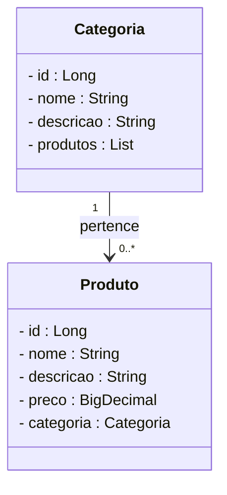

# 💊 Projeto Farmácia - Backend com Spring Boot

<div align="center">
 
</div>

<div align="center">


</div>

## 1. Descrição

O **Projeto Farmácia** é uma API desenvolvida com Java e Spring Boot que simula o backend de um sistema de gerenciamento de produtos farmacêuticos. Ideal para aprendizado de desenvolvimento com foco em APIs RESTful, persistência de dados e boas práticas com Spring.

Funcionalidades principais:

1. Cadastro, edição e exclusão de produtos (medicamentos)
2. Associação de produtos a categorias específicas
3. Consulta de produtos por nome ou categoria
4. Persistência em banco H2 para testes e demonstrações

## 2. Sobre esta API

A API foi construída utilizando o ecossistema Spring Boot, seguindo o padrão REST. Está organizada em camadas (controller, service, repository, model) e utiliza JPA + Hibernate para a persistência dos dados.

### 2.1. Principais recursos da API:

- Endpoints REST para CRUD completo de produtos e categorias
- Validações via Bean Validation (javax.validation)
- Banco de dados em memória H2 para desenvolvimento
- Documentação da API via Swagger

## 3. Estrutura de Classes



## 4. Tecnologias Utilizadas

| Item                          | Descrição       |
| ----------------------------- | --------------- |
| **Servidor**                  | Tomcat          |
| **Linguagem de programação**  | Java 17         |
| **Framework**                 | Spring Boot     |
| **ORM**                       | JPA + Hibernate |
| **Banco de dados**            | H2              |
| **Documentação**              | SpringDoc OpenAPI |
| **Dependências**              | Lombok, Validation |

## 5. Requisitos

Para executar o projeto localmente, você precisa de:

- [Java JDK 17+](https://www.oracle.com/java/technologies/javase/jdk17-archive-downloads.html)
- [Maven](https://maven.apache.org/)
- [IDE Spring Tool Suite](https://spring.io/tools) ou equivalente
- Ferramenta para testar requisições: [Postman](https://www.postman.com/) ou [Insomnia](https://insomnia.rest/)

## 6. Como Executar

```bash
git clone https://github.com/EduardoTosta/farmacia_spring.git
cd farmacia_spring
./mvnw spring-boot:run
```

Acesse a aplicação via: `http://localhost:8080`

Swagger UI: `http://localhost:8080/swagger-ui.html`

## 7. Contribuições

Este projeto é de cunho educacional, mas contribuições são bem-vindas!

- Crie uma issue
- Envie um pull request com melhorias

## 8. Contato

Desenvolvido por [**Eduardo Tosta**](https://github.com/EduardoTosta) 💻

Conecte-se comigo no [LinkedIn](https://www.linkedin.com/in/eduardo-henrique-tosta-silva/)
